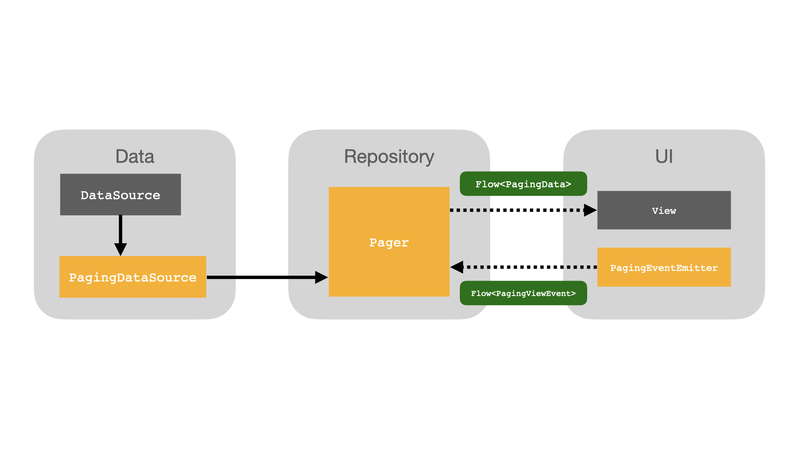
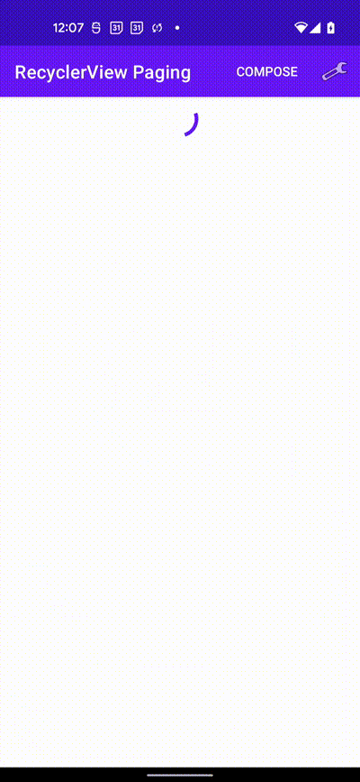
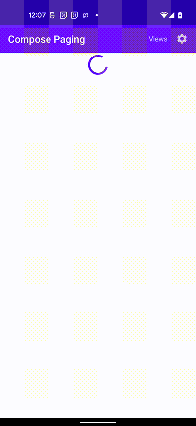
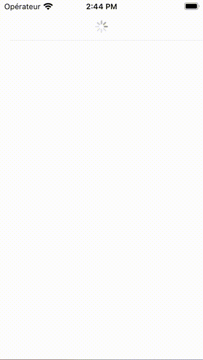
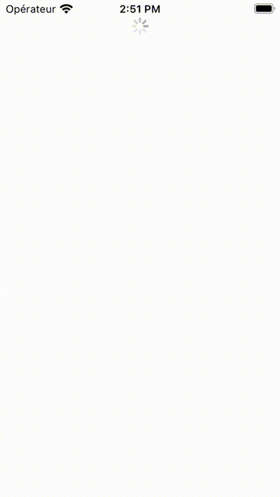

<div align="left">

  <picture>
    
  </picture>

</div>


## What is BiPaK?
BiPaK is a Kotlin multiplatform paging library. It is inspired by 
[Jetpack Paging 3](https://developer.android.com/topic/libraries/architecture/paging/v3-overview) but tries to be less a *black box* regarding data flows.

## Target architecture
The library is designed to fit into a clean architecture implementation,
support common UI patterns (MVP, MVVM, MVI...) and to be used with Kotlin Multiplatform.
<div align="left">

  <picture>
    
  </picture>

</div>

## Usage
### Create the DataSource
The first step is to implement a [`PagingDataSource`](https://nicolashaan.github.io/bipak/bipak-core/fr.haan.bipak/-paging-data-source/index.html) by sub-classing it.
It has 2 types parameters: `Key` and `Value`
`Key` is the type used to identify a page (often an Int for a page index) and the value is the type of the data in the list.

The [`load()`](https://nicolashaan.github.io/bipak/bipak-core/fr.haan.bipak/-paging-data-source/load.html) method has to do what's needed to fetch the data from a network source or a database.
it can return a page content by returning a [`PagingDataSource.LoadResult.Page`](https://nicolashaan.github.io/bipak/bipak-core/fr.haan.bipak/-paging-data-source/-load-result/-page/index.html).
In case of error, it can be exposed using [`PagingDataSource.LoadResult.Error`](https://nicolashaan.github.io/bipak/bipak-core/fr.haan.bipak/-paging-data-source/-load-result/-error/index.html)

```kotlin
try {
    // Get data from data source
    val data = dataSource.getData(params.key ?: 0, params.loadSize)
    val retData = data.items.map { it.toDomain() }

    // Return data and metadata
    return LoadResult.Page(
        data = retData,
        prevKey = null,
        nextKey = data.metadata.nextPage,
        totalCount = data.metadata.totalCount,
    )
} catch (error: Throwable) {
    // Report the error if any
    return LoadResult.Error(error)
}
```

### Instantiate a Pager
The [`Pager`](https://nicolashaan.github.io/bipak/bipak-core/fr.haan.bipak/-pager/index.html) will take the `PagingDataSource` previously defined and some configuration:
```kotlin
private val pager = Pager(
    scope = coroutineScope,
    source = dataSoure,
    initialKey = 0,
    // Optional config parameter:
    // config = PagingConfig(pageSize = 10, prefetchDistance = 5)
)
```
The `Pager` can the expose a `Flow<PagingData>` using:

```kotlin
val flow : Flow<PagingData<Value>> = pager.dataFlow
```
This flow contains the state and all the fetched data and can be consumed by the View or any other class that needs it.


### Android RecyclerView



For `RecyclerView`, [`PagingDataAdapter`](docs/bipak-android/fr.haan.bipak.android/-paging-data-adapter/index.html) can be used.

It can be retrieved using this dependency:
```kotlin
dependencies {
    implementation("fr.haan.bipak:bipak-android:0.9.0")
}
```

It is based on [ListAdapter](https://developer.android.com/reference/androidx/recyclerview/widget/ListAdapter) and therefore needs a [DiffUtil.ItemCallback](https://developer.android.com/reference/androidx/recyclerview/widget/DiffUtil.ItemCallback) implementation for the list elements type.

`PagingDataAdapter` has to be implemented and linked to a `RecyclerView` like any `ListAdapter`:
```kotlin
val adapter = UiModelAdapter()
recyclerView.layoutManager = LinearLayoutManager(context)
recyclerView.adapter = adapter
```

We then need to setup the communication between the `PagingDataAdapter` and the `Pager`.

```kotlin
lifecycleScope.launchWhenResumed {
    // pass the flow from the adapter to the pager
    pager.subscribeToViewEvents(adapter.eventFlow)
}

lifecycleScope.launchWhenResumed {
    // Get the flow from the pager and pass it to the adapter
    pager.dataFlow.collectLatest {
        // We assume that the pager exposes Domain objects
        // that needs to be converted using .toUiModel()
        adapter.submitList(it.toUiModel())
    }
}
```

When screen is ready to be displayed and data has to be fetched, 
just call:
```kotlin
adapter.start()
```
The data should be fetched as the list is scrolled.

### Jetpack Compose



Helpers are also provided for Android [Jetpack Compose](https://developer.android.com/jetpack/compose)
It can be retrieved using this dependency:
```kotlin
dependencies {
    implementation("fr.haan.bipak:bipak-compose-android:0.9.0")
}
```

The function [`collectAsLazyPagingItems()`](docs/bipak-compose-android/fr.haan.bipak.compose/collect-as-lazy-paging-items.html) is provided to expose a [`LazyPagingItems`](docs/bipak-compose-android/fr.haan.bipak.compose/-lazy-paging-items/index.html) instance.


```kotlin
val pagingData: LazyPagingItems<T> = pager.dataFlow.collectAsLazyPagingItems()
```

We then need to setup the communication between the `LazyPagingItems` and the `Pager`.

```kotlin
launch {
    pager.subscribeToViewEvents(pagingData.eventFlow)
}
```

We can then handle received elements using a Compose [LazyColumn](https://developer.android.com/jetpack/compose/lists). Two helpers are provided: `items()` and `itemsIndexed()`:

```kotlin
        LazyColumn
        {
            itemsIndexed(pagingDataState = pagingData, itemContent = { index, item ->
            // Map item to a ListItem composable
                item?.let { ListItem(index, it.content) }
            })

            // Handle Load & Error states by adding a last item to the list
            when (val loadState = pagingData.loadState) {
                PagingData.LoadState.Loading -> {
                    item { LoadingListItem() }
                }

                is PagingData.LoadState.Error -> {
                    item { ErrorListItem(loadState.error.message.orEmpty()) { pagingData.retry() } }
                }

                PagingData.LoadState.NotLoading -> { /* noop */
                }
            }
        }
```
## Swift Usage
`Flow<PagingData>` can be handled directly in Swift. [KMP-NativeCoroutines](https://github.com/rickclephas/KMP-NativeCoroutines) is used to consume it in the provided samples.

To provide scrolling event to the `Pager`, we have to instantiate a `PagingEventEmitter`.
The flow of paging events has to be passed to the `Pager` instance. 
For instance, we are using a Repository defined in the common multiplatform module to achieve this.
```swift
repository.setViewEventFlow(eventFlow: eventEmitter.eventFlow)
``` 

We also have to request the first item to trigger the fetching of the first page:
```swift
eventEmitter.onGetItem(index: 0)
```


### UIKit




To display the list, we are using a [UITableView](https://developer.apple.com/documentation/uikit/uitableview) backed by [UITableViewDiffableDataSource](https://developer.apple.com/documentation/uikit/uitableviewdiffabledatasource) data source.


`eventEmitter.onGetItem()` has to be called in the `cellProvider` closure of `UITableViewDiffableDataSource`. 

```swift
 cellProvider: { tableView, indexPath, data in
// ...
    case .Data(let item):
        let cell = tableView.dequeueReusableCell(
            withIdentifier: ItemTableViewCell.identifier,
            for: indexPath)
        // Calling event emitter with current index
        self.eventEmitter.onGetItem(index: Int32(indexPath.row))
        cell.textLabel?.text = item.content
        return cell
// ...
```

You may take a look at [the sample provided](samples/bipak-sample-ios/BiPaK%20Sample) for a complete integration example.

### SwiftUI



To consume the `Flow<PagingData>` with SwiftUI we are setting up an `ObservableObject` to connect with the common *Kotlin Multiplatform* repository.

To trigger scrolling events, [`PagingView`](samples/bipak-sample-swiftui/Shared/BiPaKSwift.swift) has to be used to encapsulate the item View.

```swift
var body: some View {
    ScrollView {
        LazyVStack {
            ForEach(
                Array(viewModel.pagingData.list.enumerated()),
                id: \.offset
            ) { index, element in
                PagingView(eventEmitter: viewModel.eventEmitter, id: index) {
                    Text(element.content)
                }
            }
            if(viewModel.pagingData.state is PagingDataLoadState.Loading) {
                ProgressView()
            }
            if let state = viewModel.pagingData.state as? PagingDataLoadState.Error {
                HStack {
                    Text(state.error.message ?? "Unknown error")
                    Button("Retry") {
                        viewModel.eventEmitter.retry()
                    }
                }
            }
            
        }
    }
}
```

You may take a look at [the sample provided](samples/bipak-sample-swiftui/Shared/ContentView.swift) for a complete integration example.

## What does BiPaK mean?
The name comes from contractions and puns based on this:
*Bibliothèque de Pagination et de Cache*, french for *Paging and Cache Library*.
First two letters of each word gives: *BiPaCa*
And as *Ca* is pronounced like the letter *K* in french and as lot of Kotlin libraries contains a *K*, *BiPaK* was chosen.

## API Reference

See [API documentation](https://nicolashaan.github.io/bipak/index.html)


Made with ❤️ at [](https://www.bam.tech)


